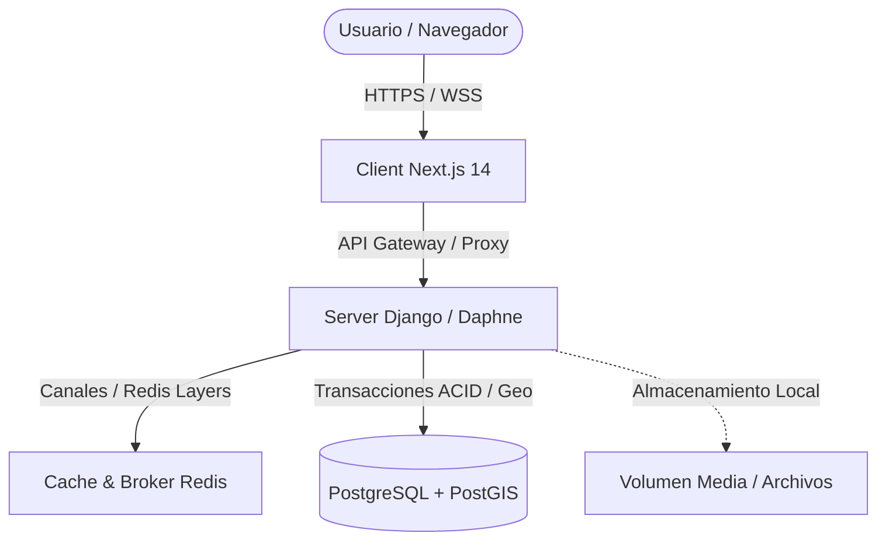
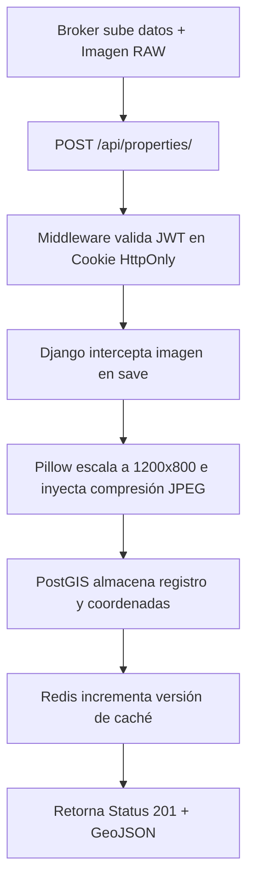
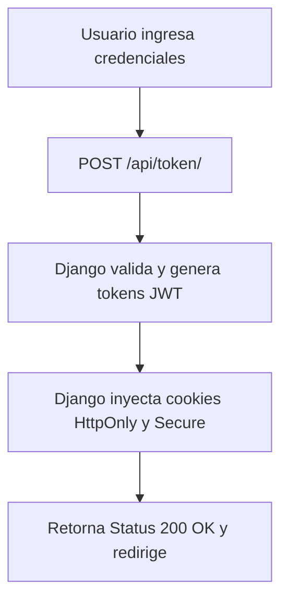

# Marketplace Inmobiliario MVP

Este repositorio contiene el Producto Minimo Viable (MVP) para la plataforma de marketplace e intermediacion inmobiliaria. El sistema esta estructurado con un backend robusto en Django y un frontend moderno con Next.js, completamente contenedorizados usando Docker.

---

## 1. Arquitectura del Sistema

La arquitectura de la plataforma esta diseñada para desacoplar el renderizado y las interacciones del cliente (Next.js) de la persistencia de datos y logica de negocio (Django REST Framework), comunicandose a traves de una red interna en Docker y consultas REST sobre HTTPS.

### Diagrama de Arquitectura General



---

## 2. Procesos Criticos de Datos y Seguridad

### Flujo de Publicacion de una Propiedad con Cache y Optimizacion

Este flujo detalla como se procesa y optimiza una imagen en el backend al subirla, y como se gestiona la consistencia de la cache de Redis reactivamente para que los listados siempre esten actualizados.



#### Detalles del Proceso de Datos:
1.  **Validacion de Credenciales:** El servidor intercepta la peticion multipart/form-data y extrae el token JWT desde las cookies del navegador. Solo los usuarios con tipo de cuenta 'broker' e invitacion activa pueden proceder con la creacion de inmuebles.
2.  **Procesamiento de Imagenes en Caliente:** Para prevenir la saturacion del almacenamiento fisico y optimizar la descarga en dispositivos moviles, el metodo `save()` del modelo `Property` intercepta la carga utilizando la libreria Pillow. Si la resolucion excede los 1200x800 pixeles, se redimensiona aplicando un remuestreo suavizado (LANCZOS). Luego se convierte a formato RGB y se comprime en formato JPEG optimizado al 75% de calidad, reduciendo el tamaño promedio de archivo de 5MB a ~250KB.
3.  **Registro Geoespacial:** La ubicacion del inmueble se almacena utilizando el motor de datos espaciales PostGIS (tipo Geometry Point con SRID WGS 84), lo que permite indexar las coordenadas para busquedas de rango de proximidad ultrarrapidas a nivel de base de datos.
4.  **Busting de Cache Selectivo:** En lugar de limpiar toda la base de datos de Redis (borrando consultas caras como los puntos de interes de OpenStreetMap), el sistema incrementa una variable `properties_cache_version`. Los listados subsiguientes leen la nueva clave de cache asociada a esta version, invalidando instantaneamente los datos antiguos unicamente para las consultas de propiedades.

---

### Flujo de Autenticacion Segura mediante JWT con Cookies

El sistema de autenticacion prescinde del almacenamiento de JWT en LocalStorage para evitar vulnerabilidades XSS, utilizando en su lugar cookies seguras configuradas desde el backend.



#### Detalles de la Arquitectura de Seguridad:
1.  **Riesgo Mitigado (XSS vs CSRF):** Almacenar tokens de acceso en el `localStorage` del navegador es inseguro, ya que cualquier script JavaScript malicioso inyectado (XSS) podria leer y robar el token de autenticacion del usuario. Al utilizar cookies `HttpOnly`, se bloquea el acceso a los tokens desde cualquier script del lado del cliente.
2.  **Politicas de Transmision Segura:**
    *   **HttpOnly:** Protege los tokens de ataques de secuestro de sesion XSS, impidiendo que `document.cookie` lea la informacion.
    *   **Secure:** Asegura que los tokens de acceso solo viajen sobre conexiones cifradas HTTPS.
    *   **SameSite=Lax (o Strict):** Previene ataques de tipo falsificacion de peticion en sitios cruzados (CSRF) al restringir la transmision de cookies en llamadas originadas desde sitios de terceros no autorizados.
3.  **Refresco Silencioso de Sesion:** El frontend lee la expiracion del Access Token. Cuando expira, realiza una llamada en segundo plano al endpoint de refresco utilizando la cookie segura del Refresh Token para obtener una nueva sesion sin requerir que el usuario vuelva a iniciar sesion manualmente.

---

---

## 3. Funcionalidades del MVP

*   **Busquedas Geoespaciales:** Utiliza coordenadas en formato WGS 84 (SRID 4326) integradas con mapas interactivos de Leaflet (importados dinamicamente para evitar errores de renderizado en el lado del servidor).
*   **Procesamiento Inteligente de Media:** Compresion reactiva de imagenes a formato JPEG en el momento de la persistencia para optimizar el ancho de banda y la velocidad de carga de las tarjetas de propiedades.
*   **Suscripciones e Integracion de Pagos:** Soporte para pasarela Payphone (tarjetas) y administracion de metodos de pago manuales (DeUna / Transferencias bancarias) con flujo de aprobacion administrativa en el panel de control.
*   **Mensajeria en Tiempo Real:** Historial de mensajeria directa entre brokers y clientes potenciales integrada de forma nativa en la base de datos con control estricto de privacidad.

---

## 4. Decisiones de Diseño: Pros y Contras

### Next.js App Router (SSR) vs. React Single Page App (SPA)
*   **Pros:**
    *   Indexacion automatica por motores de busqueda (SEO) ideal para un portal de propiedades publico.
    *   Mayor velocidad de carga inicial (FCP y LCP) mediante Server-Side Rendering (SSR).
*   **Contras:**
    *   Mayor complejidad en el manejo de dependencias de cliente que utilizan la API de `window` (como Leaflet, requiriendo importaciones dinamicas).
    *   Curva de aprendizaje mas pronunciada para la gestion de layouts y estados de servidor.

### Cache Redis Nativo en Django vs. Consultas Directas a DB
*   **Pros:**
    *   Reduce drasticamente la carga en PostgreSQL al cachear consultas de busqueda de propiedades repetitivas.
    *   Tiempos de respuesta inferiores a los 10ms en lecturas concurrentes.
*   **Contras:**
    *   Complejidad adicional al tener que manejar la invalidacion de cache manual en cada mutacion (`create`, `update`, `delete`).
    *   Consumo de memoria RAM adicional por parte del servicio Redis.

### Almacenamiento Local de Media vs. Almacenamiento en la Nube (S3 / GCS)
*   **Pros:**
    *   Facilidad de desarrollo y configuracion inicial sin costos adicionales.
    *   Acceso directo e instantaneo para procesamiento y manipulacion de imagenes en memoria de contenedor.
*   **Contras:**
    *   Dificulta la escalabilidad horizontal (requiere volumenes distribuidos si hay multiples instancias de contenedores backend).
    *   Riesgo de perdida de datos si los volumenes locales no estan respaldados de forma externa.

---

## 5. Guia de Inicio Rapido

### Requisitos Previos
*   Docker y Docker Compose
*   Node.js (para desarrollo local sin contenedores)
*   Python 3.11 (para desarrollo local sin contenedores)

### Levantar la Plataforma Completa
Para ejecutar toda la plataforma (Base de datos PostgreSQL, Redis, Django y Next.js) ejecute:

```bash
docker-compose up --build
```

### Ejecutar Pruebas Automatizadas
Para correr el conjunto de pruebas unitarias y de integracion del backend:

```bash
docker-compose exec backend python manage.py test
```

### Validacion de TypeScript
Para verificar que no existan errores de tipos en el codigo del frontend antes de realizar un despliegue:

```bash
docker-compose exec frontend npx tsc --noEmit
```
